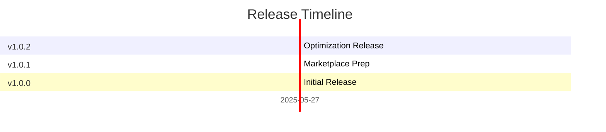

# Changelog

All notable changes to this project will be documented in this file.

## 1.0.2 (2025-05-27)
### Changed
- Optimized extension with webpack bundling (99.6% size reduction from 28MB to ~108KB)
- Enhanced build script with colored output and automated cleanup
- Improved package structure for marketplace publishing

## 1.0.1 (2025-05-27)
### Changed
- Updated publisher configuration for VS Code Marketplace
- Enhanced documentation with professional game-themed README
- Added proper repository links and marketplace metadata

## 1.0.0 (2025-05-27)
### Added
- Initial release: create and restore global save points, exclusion support, multi-root support, user-named save points, empty save point handling.

---

