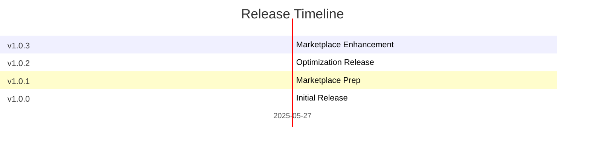

# Change Log

All notable changes to the "Global Save State" extension will be documented in this file.

Check [Keep a Changelog](http://keepachangelog.com/) for recommendations on how to structure this file.

## [1.0.3] - 2025-05-27

### Added
- Enhanced marketplace presentation with version and download badges
- Improved changelog formatting and structure for better VS Code integration
- Professional gallery banner configuration for dark theme compatibility

### Changed
- Optimized changelog format to follow VS Code extension conventions
- Enhanced package.json metadata for better marketplace discovery
- Improved extension documentation and user experience

## [1.0.2] - 2025-05-27

### Changed
- Optimized extension with webpack bundling (99.6% size reduction from 28MB to ~108KB)
- Enhanced build script with colored output and automated cleanup
- Improved package structure for marketplace publishing

## [1.0.1] - 2025-05-27

### Changed
- Updated publisher configuration for VS Code Marketplace
- Enhanced documentation with professional game-themed README
- Added proper repository links and marketplace metadata

## [1.0.0] - 2025-05-27

### Added
- Initial release: create and restore global save points
- Exclusion pattern support for ignoring specific files/folders
- Multi-root workspace support
- User-named save points with custom descriptions
- Empty save point handling and validation
- Timeline integration for visual save point management
- Keyboard shortcuts (Ctrl+Shift+S for create, Ctrl+Alt+R for restore)

---

