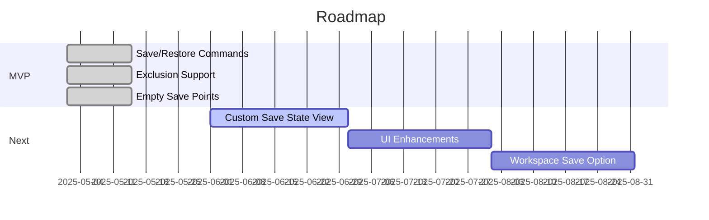

# Roadmap

## Milestones
- **MVP**: Implement save/restore commands, exclusion support, and empty save points. (Q2 2025)
- **Custom Save State View**: Visual tree view for save points. (Q3 2025)
- **UI Enhancements**: Add save point management UI. (Q3 2025)
- **Workspace Save Option**: Optionally store save points in workspace. (Q4 2025)

## Future Plans
- Integrate with a custom tree view for visual navigation.
- Add support for deleting and renaming save points.
- Improve performance for large workspaces.
- Add notifications for restore actions.

## Completed
- Project setup and initial extension scaffolding.
- Save/restore logic with exclusion support.
- User-named save points and empty save point handling.

---

