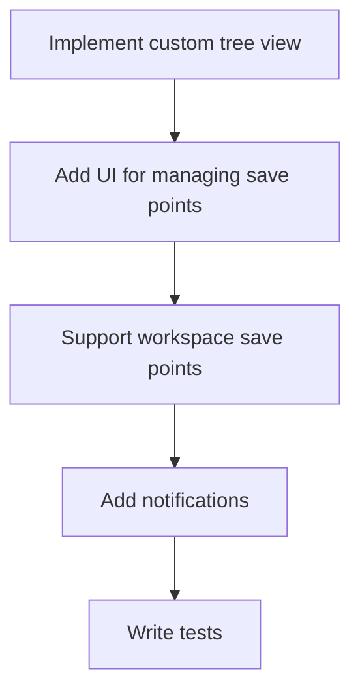

# TODO

## Tasks
- [ ] Implement custom tree view for save points.
- [ ] Add UI for managing (delete/rename) save points.
- [ ] Support storing save points in workspace folder (optional).
- [ ] Add notifications for restore actions.
- [ ] Write tests for save/restore logic.

## Bugs
- [ ] Handle file permission errors gracefully during restore.
- [ ] Ensure exclusion patterns are respected for all workspace folders.

## Features
- [x] Create save point for all files (except excluded).
- [x] Restore save point to workspace.
- [x] Support user-named save points.
- [x] Create empty save point if no changes.
- [x] Multi-root workspace support.

---

